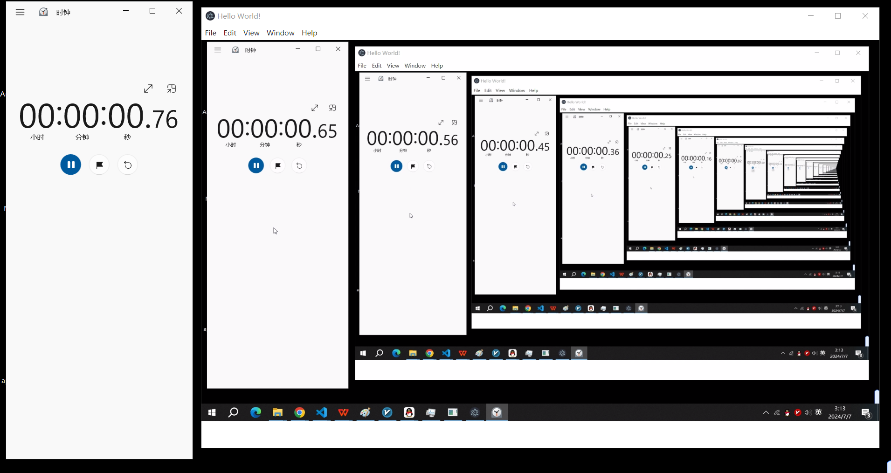

# media-decoder

A media decoder based on FFmpeg and a Node.js addon for rendering, recording, and capturing media formats such as RTSP.

## install

```bash
npm i media-decoder
```

## usage

```js
const { MediaDecoder } = require("media-decoder")

let canvas = document.querySelector("#canvas")
let mediaDecoder = new MediaDecoder();

mediaDecoder.setInputUrl("rtsp://localhost:8554/mystream")
// mediaDecoder.setInputFormat("rtsp")
// mediaDecoder.setInputOption()
mediaDecoder.openInput()
mediaDecoder.initDecoder()
mediaDecoder.setupCanvas(canvas)
mediaDecoder.decode()
```

## performance

